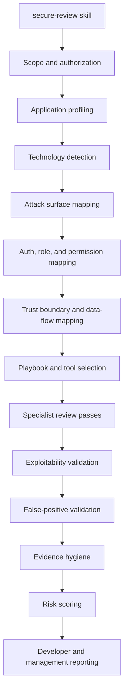

# Secure Code Review Skills

Claude Code and Codex skill packages for authorized defensive source code security review.

These packages are designed for one application at a time and default to detection-only review. They focus on attack-surface mapping, authentication and role mapping, permission matrices, trust boundaries, OWASP/CWE review, Semgrep/SCA/SBOM triage, evidence hygiene, false-positive reduction, and developer-ready reporting.

GitHub Pages: https://rs-lucifer.github.io/secure-code-review-skills/

## Packages

| Package | Path | Purpose |
| --- | --- | --- |
| Claude Code | `packages/claude-code/secure-review-claude-code` | Claude Code skill, specialist agents, hooks, and review workflow. |
| Codex | `packages/codex/secure-review-codex` | Codex-compatible skill with `AGENTS.md`, `.agents/skills/secure-review`, references, and helper scripts. |

Downloadable ZIP archives are in `packages/`:

- `packages/secure-review-claude-code-skill.zip`
- `packages/secure-review-codex-skill.zip`

Release downloads are published from GitHub Releases when version tags are pushed.

## Review Flow Graph



## Repository Structure

```text
secure-code-review-skills/
|-- README.md
|-- SECURITY.md
|-- CONTRIBUTING.md
|-- docs/
|   |-- index.html
|   |-- prompts.html
|   |-- prompts.md
|   |-- anatomy.html
|   |-- anatomy.md
|   |-- installation.md
|   |-- usage.md
|   `-- validation.md
|-- packages/
|   |-- secure-review-claude-code-skill.zip
|   |-- secure-review-codex-skill.zip
|   |-- claude-code/
|   |   `-- secure-review-claude-code/
|   |       `-- .claude/
|   |           |-- skills/secure-review/
|   |           |-- agents/
|   |           `-- hooks/
|   `-- codex/
|       `-- secure-review-codex/
|           |-- AGENTS.md
|           `-- .agents/skills/secure-review/
`-- scripts/
    `-- validate-packages.ps1
```

Full target anatomy: [docs/anatomy.md](docs/anatomy.md)

## Quick Start

### Claude Code

Project-local install:

```bash
cp -R packages/claude-code/secure-review-claude-code/.claude /path/to/app/.claude
cd /path/to/app
claude
/secure-review Review this application in detection-only mode. Start with app profiling and role mapping.
```

Personal skill install:

```bash
mkdir -p ~/.claude/skills
cp -R packages/claude-code/secure-review-claude-code/.claude/skills/secure-review ~/.claude/skills/secure-review
```

### Codex

Project-local install:

```bash
cp packages/codex/secure-review-codex/AGENTS.md /path/to/app/AGENTS.md
cp -R packages/codex/secure-review-codex/.agents /path/to/app/.agents
cd /path/to/app
codex
```

Prompt:

```text
Use the secure-review skill. Review this application in detection-only mode. Start with app profiling and role/permission mapping.
```

## Review Standard

A final security finding must include:

- affected file and function/class/module
- affected route, API, job, webhook, or mobile path when applicable
- attacker-controlled source
- dangerous sink or missing security control
- impacted role, tenant, or object when applicable
- realistic impact
- safe validation or retest steps
- remediation guidance
- validation status

Finding statuses:

- `TRUE POSITIVE`
- `LIKELY TRUE POSITIVE`
- `NEEDS MANUAL VALIDATION`
- `FALSE POSITIVE`
- `HARDENING`

## Documentation

- [Installation](docs/installation.md)
- [Usage](docs/usage.md)
- [Ready-to-Use Prompts](docs/prompts.md)
- [Skill Anatomy](docs/anatomy.md)
- [Validation](docs/validation.md)
- [GitHub Upload](docs/github-upload.md)
- GitHub Pages site: `docs/index.html`

## Safety

Use these skills only for authorized defensive review. Do not use production credentials, destructive commands, or active exploitation unless the owner explicitly approves a scoped test environment.

## License

This project is released under the [MIT License](LICENSE).
