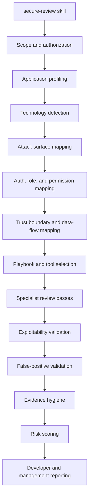

<p align="center">
  
</p>

# Secure Code Review Skills

<p align="center">
  <a href="https://rs-lucifer.github.io/secure-code-review-skills/">GitHub Pages</a> |
  <a href="https://rs-lucifer.github.io/secure-code-review-skills/prompts.html">Prompt Library</a> |
  <a href="https://rs-lucifer.github.io/secure-code-review-skills/anatomy.html">Skill Anatomy</a> |
  <a href="https://github.com/RS-Lucifer/secure-code-review-skills/releases">Releases</a>
</p>

<p align="center">
  <a href="https://rs-lucifer.github.io/secure-code-review-skills/"></a>
  <a href="https://github.com/RS-Lucifer/secure-code-review-skills/releases/tag/v1.0.1"></a>
  <a href="LICENSE"></a>
  <a href="https://github.com/RS-Lucifer/secure-code-review-skills/actions/workflows/pages.yml"></a>
</p>

**Claude Code and Codex skill packages for evidence-backed secure source code review.**

`secure-review` is built for one application at a time. It starts with app profiling, attack-surface mapping, role and permission mapping, trust-boundary review, and source-to-sink validation before it reports vulnerabilities. The default mode is detection-only, with strong false-positive control and reporting built for real AppSec review.

<table>
<tr><td><b>Evidence-first security review</b></td><td>Findings require affected file/function, reachable entry point, attacker-controlled source, missing control or dangerous sink, realistic impact, remediation, and safe retest steps.</td></tr>
<tr><td><b>Claude Code and Codex packages</b></td><td>Ships both <code>.claude/skills/secure-review</code> and <code>.agents/skills/secure-review</code> layouts with matching review logic.</td></tr>
<tr><td><b>Low false positives</b></td><td>Every candidate passes reachability, attacker control, source-to-sink, existing-control, authorization, impact, and evidence gates before final reporting.</td></tr>
<tr><td><b>Role and permission mapping</b></td><td>Forces role matrix, permission matrix, object ownership, tenant boundary, and admin/support/service-account boundary review before vulnerability claims.</td></tr>
<tr><td><b>Specialist review model</b></td><td>Uses targeted lenses for access control, injection, SSRF, file security, deserialization, secrets, crypto, API, GraphQL, mobile, cloud, CI/CD, and supply chain review.</td></tr>
<tr><td><b>Ready-to-use prompt library</b></td><td>Includes prompts for full application review, maximum discovery, false-positive reduction, access-control review, and final report generation.</td></tr>
<tr><td><b>Release ZIPs</b></td><td>GitHub Releases publish downloadable Claude Code and Codex ZIP packages, each including the MIT license.</td></tr>
</table>

---

## Quick Install

### Claude Code

Project-local install:

```bash
cp -R packages/claude-code/secure-review-claude-code/.claude /path/to/app/.claude
cd /path/to/app
claude
/secure-review Review this application in detection-only mode. Start with app profiling and role mapping.
```

Personal skill install:

```bash
mkdir -p ~/.claude/skills
cp -R packages/claude-code/secure-review-claude-code/.claude/skills/secure-review ~/.claude/skills/secure-review
```

For specialist agents, copy `packages/claude-code/secure-review-claude-code/.claude/agents/` into the target repo's `.claude/agents/` directory.

### Codex

Project-local install:

```bash
cp packages/codex/secure-review-codex/AGENTS.md /path/to/app/AGENTS.md
cp -R packages/codex/secure-review-codex/.agents /path/to/app/.agents
cd /path/to/app
codex
```

Then ask:

```text
Use the secure-review skill. Review this application in detection-only mode. Start with app profiling and role/permission mapping.
```

---

## Getting Started

```text
Use the secure-review skill.

Review this application end to end in detection-only mode. Do not modify code unless I explicitly approve.

Start with:
1. application profiling,
2. technology stack detection,
3. attack surface mapping,
4. authentication flow mapping,
5. role mapping,
6. permission matrix creation,
7. trust boundary mapping,
8. vulnerability playbook selection,
9. deterministic scan review,
10. exploitability validation,
11. false-positive validation,
12. final reporting.

Only include TRUE POSITIVE and LIKELY TRUE POSITIVE in the final vulnerability section.
```

Full prompt set: [docs/prompts.md](docs/prompts.md)

---

## Review Flow



---

## Repository Structure

```text
secure-code-review-skills/
|-- README.md
|-- LICENSE
|-- SECURITY.md
|-- CONTRIBUTING.md
|-- docs/
|   |-- index.html
|   |-- prompts.html
|   |-- prompts.md
|   |-- anatomy.html
|   |-- anatomy.md
|   |-- installation.md
|   |-- usage.md
|   `-- validation.md
|-- packages/
|   |-- secure-review-claude-code-skill.zip
|   |-- secure-review-codex-skill.zip
|   |-- claude-code/
|   |   `-- secure-review-claude-code/
|   |       |-- LICENSE
|   |       `-- .claude/
|   |           |-- skills/secure-review/
|   |           |-- agents/
|   |           `-- hooks/
|   `-- codex/
|       `-- secure-review-codex/
|           |-- AGENTS.md
|           |-- LICENSE
|           `-- .agents/skills/secure-review/
`-- scripts/
    `-- validate-packages.ps1
```

Full target anatomy: [docs/anatomy.md](docs/anatomy.md)

---

## Release Downloads

The latest release is [v1.0.1](https://github.com/RS-Lucifer/secure-code-review-skills/releases/tag/v1.0.1).

| Asset | Purpose |
| --- | --- |
| [`secure-review-claude-code-skill.zip`](https://github.com/RS-Lucifer/secure-code-review-skills/releases/download/v1.0.1/secure-review-claude-code-skill.zip) | Claude Code package with `.claude/skills/secure-review`, agents, hooks, references, and scripts. |
| [`secure-review-codex-skill.zip`](https://github.com/RS-Lucifer/secure-code-review-skills/releases/download/v1.0.1/secure-review-codex-skill.zip) | Codex package with `AGENTS.md`, `.agents/skills/secure-review`, references, and scripts. |

Both ZIP assets include the MIT license.

---

## Documentation

| Section | What is covered |
| --- | --- |
| [Installation](docs/installation.md) | Claude Code and Codex install paths, project-local setup, optional Semgrep setup. |
| [Usage](docs/usage.md) | Recommended review prompt, review flow, validation gate, and finding output expectations. |
| [Prompt Library](docs/prompts.md) | Copyable prompts for full app review, maximum discovery, false-positive reduction, access-control review, and final reporting. |
| [Skill Anatomy](docs/anatomy.md) | Complete target anatomy for the Claude Code and Codex secure-review skill packages. |
| [Validation](docs/validation.md) | Package validation checks, redaction smoke tests, JSON parsing, and quick validation notes. |
| [GitHub Pages](https://rs-lucifer.github.io/secure-code-review-skills/) | Published documentation site. |

---

## Review Standard

A final security finding must include:

- affected file and function/class/module
- affected route, API, job, webhook, or mobile path when applicable
- attacker-controlled source
- dangerous sink or missing security control
- impacted role, tenant, or object when applicable
- realistic impact
- safe validation or retest steps
- remediation guidance
- validation status

Finding statuses:

- `TRUE POSITIVE`
- `LIKELY TRUE POSITIVE`
- `NEEDS MANUAL VALIDATION`
- `FALSE POSITIVE`
- `HARDENING`

---

## Validation

Run the package checks locally:

```powershell
.\scripts\validate-packages.ps1
```

The validation script checks Python helper compilation, JSON playbook parsing, and redaction behavior. Release ZIPs were rebuilt from the checked package roots.

---

## Contributing

Keep the project focused on authorized defensive source code review:

- preserve detection-only behavior by default
- require attack-surface, role, permission, and trust-boundary mapping before final findings
- keep confirmed, likely, manual-validation, false-positive, and hardening items separate
- do not include real secrets, tokens, cookies, keys, or customer data in examples

See [CONTRIBUTING.md](CONTRIBUTING.md).

---

## Security

Use this project only for authorized defensive review. Do not use production credentials, destructive commands, or active exploitation unless the owner explicitly approves a scoped test environment.

See [SECURITY.md](SECURITY.md).

---

## License

MIT - see [LICENSE](LICENSE).
