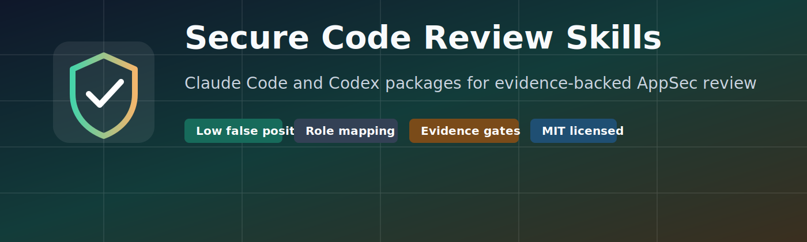
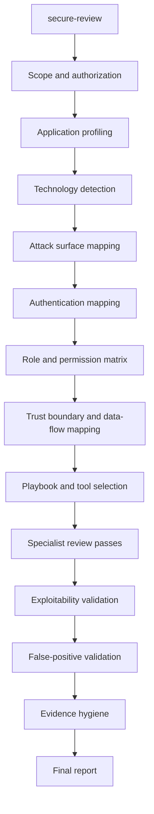

# claude-codex-secure-review

> A Claude Code + Codex skill bundle for defensive secure source-code review: one `secure-review` workflow, 55 Claude specialist agent definitions, Codex project instructions, evidence gates, false-positive reduction, role/permission mapping, prompt library, GitHub Pages docs, and release ZIPs for both harnesses.

Built for **Claude Code** and **OpenAI Codex** users who want AppSec review output that is grounded in reachability, source-to-sink evidence, missing-control proof, and realistic business impact.

<p align="center">
  <a href="https://rs-lucifer.github.io/secure-code-review-skills/"></a>
  <a href="https://github.com/RS-Lucifer/secure-code-review-skills/releases/tag/v1.0.1"></a>
  <a href="LICENSE"></a>
  <a href="https://github.com/RS-Lucifer/secure-code-review-skills/actions/workflows/pages.yml"></a>
</p>

---

## What is this?

`claude-codex-secure-review` is a drop-in secure-review skill package for **Claude Code** and **Codex**. Install it into a repository, point the agent at one application, and it follows a strict defensive AppSec workflow:

- **Map first** - app profile, framework, routes/APIs, jobs, webhooks, auth flows, roles, permissions, tenants, objects, trust boundaries.
- **Hunt with evidence** - access control, IDOR/BOLA, tenant isolation, auth, injection, SSRF, file security, deserialization, secrets, cloud/IAM, CI/CD, supply chain, mobile APIs, and business logic.
- **Validate hard** - reachability, attacker control, source-to-sink path, existing middleware/framework/IAM controls, realistic impact, and false-positive review.
- **Ship clean reports** - confirmed findings, likely findings, needs manual validation, hardening notes, false positives removed, developer remediation, and management summary.

The default mode is **detection-only**. It reads code, runs safe static checks when allowed, and reports. It does not modify code or perform active testing unless the user explicitly approves a scoped fix or validation task.

---

## Quickstart

### Option A - Claude Code package

Project-local install:

```bash
cp -R packages/claude-code/secure-review-claude-code/.claude /path/to/app/.claude
cd /path/to/app
claude
/secure-review Review this application in detection-only mode. Start with app profiling and role mapping.
```

Personal skill install:

```bash
mkdir -p ~/.claude/skills
cp -R packages/claude-code/secure-review-claude-code/.claude/skills/secure-review ~/.claude/skills/secure-review
```

For the Claude specialist agents, copy:

```bash
cp -R packages/claude-code/secure-review-claude-code/.claude/agents /path/to/app/.claude/agents
```

### Option B - Codex package

Project-local install:

```bash
cp packages/codex/secure-review-codex/AGENTS.md /path/to/app/AGENTS.md
cp -R packages/codex/secure-review-codex/.agents /path/to/app/.agents
cd /path/to/app
codex
```

Then ask:

```text
Use the secure-review skill. Review this application in detection-only mode. Start with app profiling and role/permission mapping.
```

### Release ZIPs

Download from the latest release:

| Asset | Harness |
|---|---|
| [`secure-review-claude-code-skill.zip`](https://github.com/RS-Lucifer/secure-code-review-skills/releases/download/v1.0.1/secure-review-claude-code-skill.zip) | Claude Code |
| [`secure-review-codex-skill.zip`](https://github.com/RS-Lucifer/secure-code-review-skills/releases/download/v1.0.1/secure-review-codex-skill.zip) | Codex |

Both ZIPs include the MIT license.

---

## Runs on two harnesses

This repository ships matching secure-review logic for both supported agent harnesses:

| Harness | Entry point | Package path | Notes |
|---|---|---|---|
| **Claude Code** | `/secure-review` | `packages/claude-code/secure-review-claude-code/.claude/skills/secure-review` | Includes the skill, 55 specialist agent definitions, hooks, references, and helper scripts. |
| **Codex** | `Use the secure-review skill` | `packages/codex/secure-review-codex/.agents/skills/secure-review` | Includes `AGENTS.md`, Codex skill metadata, references, and helper scripts. |

---

## Scope - what this bundle is for

This bundle is for **authorized defensive source-code review** of one application at a time.

### In scope

- Application security source review
- API, web, mobile API, GraphQL, job, queue, webhook, admin, and service-to-service review
- Role, permission, object ownership, tenant isolation, and admin boundary mapping
- OWASP/CWE review with evidence-backed findings
- Semgrep/SCA/SBOM triage when tools are available and approved
- False-positive reduction and report generation
- Developer remediation and safe retest guidance

### Out of scope

- Unauthorized testing
- Production exploitation without explicit approval
- Credential use against live systems without explicit authorization
- Malware, persistence, evasion, ransomware, or post-exploitation tooling
- Scanner-only reports without manual validation
- WAF-only claims unless backend impact is proven

---

## What's inside

| Area | Included |
|---|---|
| Core skill | `secure-review` skill for Claude Code and Codex |
| Claude agents | 55 specialist agent definition files for focused review lenses |
| Prompt library | Full review, maximum discovery, false-positive reduction, access-control review, final report generation |
| References | Workflow, agent catalog, role/permission mapping, OWASP/CWE mapping, Semgrep, harness, report templates |
| Helper scripts | Finding schema check, redaction helper, safe Semgrep wrapper |
| Package docs | README, install guide, usage guide, validation guide, GitHub Pages site |
| Release assets | Claude Code ZIP and Codex ZIP |

Full anatomy: **[docs/anatomy.md](docs/anatomy.md)**  
Published anatomy page: **[rs-lucifer.github.io/secure-code-review-skills/anatomy.html](https://rs-lucifer.github.io/secure-code-review-skills/anatomy.html)**

---

## How it works



The review is intentionally non-reporting until the foundation is mapped. Candidate findings are not final findings. A finding only graduates after it passes reachability, attacker-control, source-to-sink, missing-control, impact, and false-positive gates.

---

## 7-Question Gate

Every candidate finding must answer:

1. Is the affected code reachable from a real entry point?
2. Is attacker-controlled or lower-privileged input involved?
3. Is there a proven source-to-sink path or missing authorization/security control?
4. Are authentication, authorization, validation, and sanitization controls absent, weak, or bypassable?
5. Is the impact real in this application's deployment and role model?
6. Is there evidence: file, function, route/API/job, role, source, sink, impact?
7. Is the finding not blocked by centralized middleware, framework guards, row-level security, WAF/gateway-only constraints, IAM policy, or other effective controls?

Final status values:

- `TRUE POSITIVE`
- `LIKELY TRUE POSITIVE`
- `NEEDS MANUAL VALIDATION`
- `FALSE POSITIVE`
- `HARDENING`

---

## Documentation

| Doc | Contents |
|---|---|
| [`docs/installation.md`](docs/installation.md) | Claude Code and Codex install paths, project-local setup, optional Semgrep setup |
| [`docs/usage.md`](docs/usage.md) | Recommended review prompt, review flow, validation gate, output expectations |
| [`docs/prompts.md`](docs/prompts.md) | Copyable prompts for full review, maximum discovery, false-positive reduction, access-control review, final reporting |
| [`docs/anatomy.md`](docs/anatomy.md) | Complete Claude Code and Codex target anatomy |
| [`docs/validation.md`](docs/validation.md) | Package validation checks and local validation commands |
| [`CONTRIBUTING.md`](CONTRIBUTING.md) | Contribution rules and skill quality expectations |
| [`SECURITY.md`](SECURITY.md) | Authorized-use posture and issue reporting guidance |
| [`LICENSE`](LICENSE) | MIT license |

Full docs site: **[rs-lucifer.github.io/secure-code-review-skills](https://rs-lucifer.github.io/secure-code-review-skills/)**

---

## Repository structure

```text
secure-code-review-skills/
|-- README.md
|-- LICENSE
|-- SECURITY.md
|-- CONTRIBUTING.md
|-- docs/
|   |-- index.html
|   |-- prompts.html
|   |-- prompts.md
|   |-- anatomy.html
|   |-- anatomy.md
|   |-- installation.md
|   |-- usage.md
|   `-- validation.md
|-- packages/
|   |-- secure-review-claude-code-skill.zip
|   |-- secure-review-codex-skill.zip
|   |-- claude-code/
|   |   `-- secure-review-claude-code/
|   |       |-- LICENSE
|   |       `-- .claude/
|   |           |-- skills/secure-review/
|   |           |-- agents/
|   |           `-- hooks/
|   `-- codex/
|       `-- secure-review-codex/
|           |-- AGENTS.md
|           |-- LICENSE
|           `-- .agents/skills/secure-review/
`-- scripts/
    `-- validate-packages.ps1
```

---

## Why this exists

Most AI-assisted security reviews fail in one of two ways:

1. They produce scanner-shaped noise without proving reachability, attacker control, or impact.
2. They find interesting code smells but skip role, permission, tenant, and trust-boundary mapping.

This bundle pushes Claude Code and Codex toward the review behavior expected from a senior AppSec engineer: map the system first, separate candidates from confirmed findings, remove weak claims, and write reports that a developer can actually fix.

---

## Roadmap

- [ ] Add richer package-native examples for Claude Code and Codex
- [ ] Add more Semgrep rule examples and test fixtures
- [ ] Add report samples for web, API, mobile API, and cloud-heavy applications
- [ ] Add a generated skill catalog page
- [ ] Add release notes per package version

---

## Validation

Run local package validation:

```powershell
.\scripts\validate-packages.ps1
```

The validator checks Python helper compilation, vulnerability playbook JSON parsing, and secret-redaction behavior. The release ZIPs are rebuilt from the checked package roots.

---

## Authorization

Use these skills only for repositories and systems you own or have written authorization to review. The default mode is detection-only and source-review oriented. Active testing, credential use, exploit validation, and source edits require explicit approval and a scoped environment.

---

## About

`claude-codex-secure-review` packages a defensive application-security review workflow for two agent environments: **Claude Code** and **OpenAI Codex**.

Repository: [RS-Lucifer/secure-code-review-skills](https://github.com/RS-Lucifer/secure-code-review-skills)

---

## License

MIT - see [LICENSE](LICENSE).
